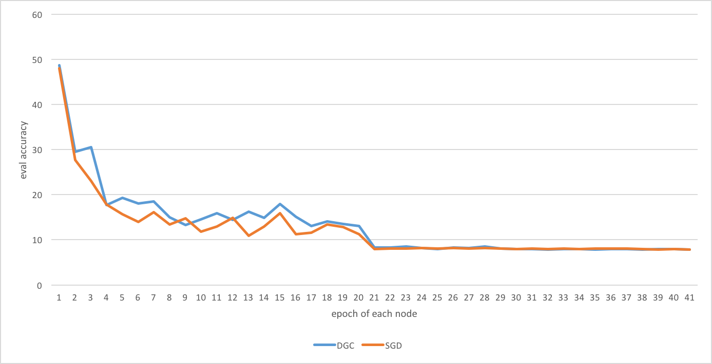

## Deep Gradient Compression: Reducing the Communication Bandwidth for Distributed Training
This is a code repository used to implement a gradient compression method mentioned in [ICLR 2018 paper](https://arxiv.org/pdf/1712.01887.pdf)
It is based off [convNet.pytorch](https://github.com/eladhoffer/convNet.pytorch) with some helpful options such as
You can run it on a GPU or CPU cluster.

## Dependencies

- [pytorch](<http://www.pytorch.org>)
- [torchvision](<https://github.com/pytorch/vision>) to load the datasets, perform image transforms
- [pandas](<http://pandas.pydata.org/>) for logging to csv

## Data
- Configure your dataset path at **data.py**.
- To get the ILSVRC data, you should register on their site for access: <http://www.image-net.org/>

## Usage
how to use DGCoptimizer
```python
    optimizer = torch.optim.SGD(model.parameters(), lr=args.lr)
    optimizer = DGCDistributedOptimizer(optimizer, named_parameters=model.named_parameters(), use_gpu=False, momentum=0.9, weight_decay=1e-4)
```
## Experiment examples
run it with mpirun
```bash
./submit_dist_dgc.sh
```

## Results
In a case using resnet44 on cifar10 dataset, compare DGC with SGD.


## Model configuration

Network model is defined by writing a <modelname>.py file in <code>models</code> folder, and selecting it using the <code>model</code> flag. Model function must be registered in <code>models/\_\_init\_\_.py</code>
The model function must return a trainable network. It can also specify additional training options such optimization regime (either a dictionary or a function), and input transform modifications.

e.g for a model definition:

```python
class Model(nn.Module):

    def __init__(self, num_classes=1000):
        super(Model, self).__init__()
        self.model = nn.Sequential(...)

        self.regime = {
            0: {'optimizer': 'SGD', 'lr': 1e-2,
                'weight_decay': 5e-4, 'momentum': 0.9},
            15: {'lr': 1e-3, 'weight_decay': 0}
        }

        self.input_transform = {
            'train': transforms.Compose([...]),
            'eval': transforms.Compose([...])
        }
    def forward(self, inputs):
        return self.model(inputs)

 def model(**kwargs):
        return Model()
```

## Author
Jiarui Fang 
fjr14@mails.tsinghua.edu.cn
